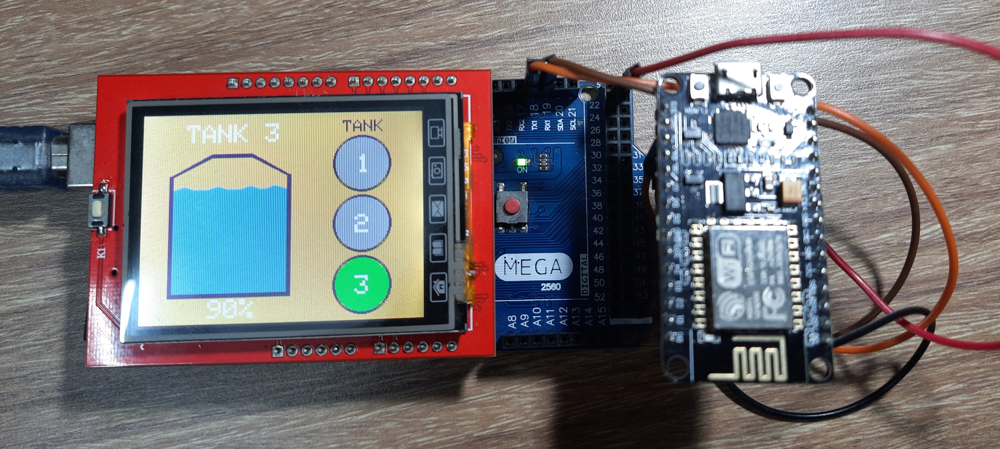

## Contents:
<ol>
   <li><a href="https://s-nithish-kumar.github.io/IoT_based_Smart_Tank_Water_Level_Monitoring/#1-problem-statement">Problem Statement</a></li>
   <li><a href="https://s-nithish-kumar.github.io/IoT_based_Smart_Tank_Water_Level_Monitoring/#2-objectives">Objectives</a></li>
   <li><a href="https://s-nithish-kumar.github.io/IoT_based_Smart_Tank_Water_Level_Monitoring/#3-impact-of-solving-the-problem">Impact of Solving the Problem</a></li>
   <li><a href="https://s-nithish-kumar.github.io/IoT_based_Smart_Tank_Water_Level_Monitoring/#4-existing-products">Existing Products</a></li>
   <li><a href="https://s-nithish-kumar.github.io/IoT_based_Smart_Tank_Water_Level_Monitoring/#5-proposed-approach">Proposed Approach</a></li>
   <li><a href="https://s-nithish-kumar.github.io/IoT_based_Smart_Tank_Water_Level_Monitoring/#6-process-flow">Process Flow</a></li>
   <li><a href="https://s-nithish-kumar.github.io/IoT_based_Smart_Tank_Water_Level_Monitoring/#7-circuit-design">Circuit Design</a></li>
   <li><a href="https://s-nithish-kumar.github.io/IoT_based_Smart_Tank_Water_Level_Monitoring/#8-real-time-database">Real-time Database</a></li>
   <li><a href="https://s-nithish-kumar.github.io/IoT_based_Smart_Tank_Water_Level_Monitoring/#9-implementation">Implementation</a>
   <ul>
      <li><a href="https://s-nithish-kumar.github.io/IoT_based_Smart_Tank_Water_Level_Monitoring/#user-interface">User Interface</a> </li>
      <li><a href="https://s-nithish-kumar.github.io/IoT_based_Smart_Tank_Water_Level_Monitoring/#tank-side">Tank Side</a></li>
      <li><a href="https://s-nithish-kumar.github.io/IoT_based_Smart_Tank_Water_Level_Monitoring/#component-housing">Component Housing</a></li>
   </ul></li>
   <li><a href="https://s-nithish-kumar.github.io/IoT_based_Smart_Tank_Water_Level_Monitoring/#10-conclusion-and-future-works">Conclusion and Future Works</a></li>
   <li><a href="https://s-nithish-kumar.github.io/IoT_based_Smart_Tank_Water_Level_Monitoring/#11-references">References</a></li>
</ol>

### 1. Problem Statement:
- Turning a water pump on and off is an easy task, but due to other busy chores, people tend to forget to turn the pump off, which results in water overflow and waste.
+ A system that can turn the pump on when the tank empties and turn the pump off before the tank overflows can help to avoid water waste.

### 2. Objectives:
- To design and develop a wireless system using IoT and integrate it with Ultrasonic sensors for water level monitoring.
- Display the real time water level using a touch based interactive screen and give the low and overflow alerts using LEDs or a buzzer.

### 3. Impact of Solving the Problem:
- In a few places, the overflowing water is directed toward plants and trees to avoid waste. But in most scenarios, the overflow is not directed and goes to waste. This alert device can help overcome this problem.
- In most places, water is scarce, and the monthly bill is based on the amount of water consumed. Avoiding water wastage by overflow will help reduce the water bill.
- The device, being IoT-based, is wireless, which overcomes the problem of wire routing from tank to water pump.

### 4. Existing Products:
- Most of the existing products have wire connections between the controller and tank-side hardware that need to be routed from the tank to the water pump, which increases the complexity.
- The devices can detect only low and high levels, not the water level in between the low and high ranges. Continuous water level tracking can help the user turn the pump on manually when required, and this will help in situations when the user gets a water blockage alert, typically for repairing the pipelines.
- Continuous water level consumption tracking can help service providers charge the bill accordingly.

### 5. Proposed Approach:
- The approach shown in Figure 1 proposes SMPS, or solar, as a power supply for both the tank side and the user side. 

Figure 1 Proposed Concept

- Two NodeMCUs are used for uploading and receiving data. An Arduino and LCD display are used on the user side for receiving water levels and displaying them.
- The NodeMCU on the user side receives new data that will be passed to the Arduino through serial communication.
- Figure 2 shows the components needed for the proposed concept

Figure 2 Components Used

### 6. Process Flow:
The overall process flow is shown in Figure 3. The water-resistant Ultrasonic sensor estimates the water level, and the data is updated using the NodeMCU on top of the tank in Google Firebase whenever the value changes. The NodeMCU in the user interface reads the updated value and displays it on the LCD screen. LEDs are used to indicate the high and low water levels in the tanks.

Figure 3 Process Flow

### 7. Circuit Design:
Figures 4 and 5 show the circuit diagram that was implemented on the tank and user sides, respectively.

Figure 4 Tank Side Circuit Design

Figure 5 User Side Circuit Design

### 8. Real-time Database:
The values obtained from the tank-side module will be sent to Google Firebase via NodeMCU. The image below shows the data obtained from the tank module in a real-time database.

Figure 6 Real-time Database

### 9. Implementation:
#### User Interface:
Once the device is powered, the LCD screen boots. The user can press on the screen once to monitor the tank levels.

Figure 7 Boot Screen

Figure 8 Water Level in Tank 1

Figure 9 Water Level in Tank 2

Figure 10 Water Level in Tank 3

When the tank level rises above 97%, the green LED will turn on, and when the tank level goes below 6%, the red LED will turn on.

Figure 11 Tank Level Above 97%

Figure 12 Tank Level Below 6%

#### Tank Side:
The circuit board will be enclosed in a case and placed near the tank, whereas the probe goes inside to measure the water level.

Figure 13 Tank Side Setup

#### Component Housing:
Housing is designed both for the User Interface and the tank side setup to enclose all the components and protect them from weather.

Figure 14 User Interface Case Design

Figure 15 Tank Circuit Case Design

### 10. Conclusion and Future Works:
-The presented framework is more appropriate to monitor water tank level continuously and on a real-time basis. 
+ Use solar energy for power supply to improve power backup.
+ Improve the user interface with additional features like water consumption, etc.
- Integrate additional components to automatically turn on and off the pump.
- Develop a mobile application for remote operations.

### 11. References:

